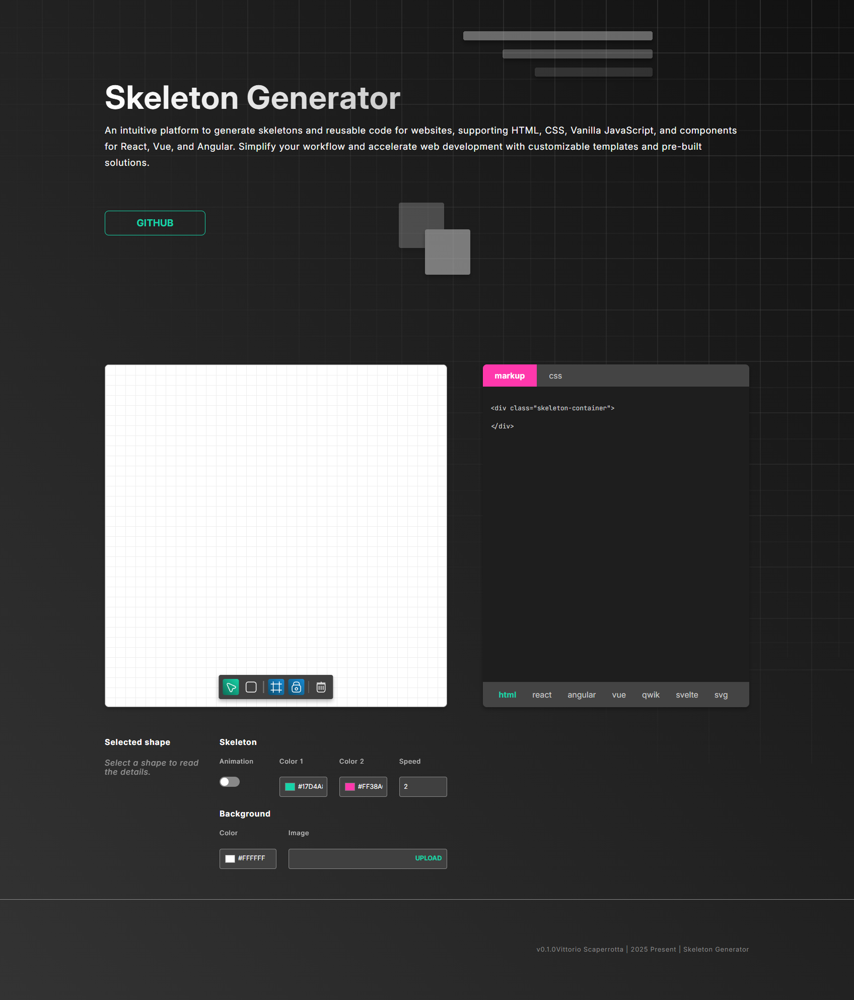

# Skeleton Generator
---
Tool to generate skeleton and return HTML, CSS or Framework Component.

This tool allows you to draw the necessary shapes for your skeleton on a board, and export them in different formats.

In particular, the interface allows you to draw shapes, move them to a grid and delete them individually or all at once. It is possible to hide the grid and remove the snap to the grid.
On the right hand side, the user is then offered the output of the code in different frameworks.

Finally, below the drawing board are settings with which to customise the board and the shapes, such as colour, animation and border radius.

You can visit the skeleton-generator at this [link](https://skeleton-generator-ui.vercel.app/).
